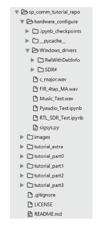

# SP-Comm Tutorial using *scikit-dsp-comm*

A tutorial on signal processing and communications using `scikit-dsp-comm`, including hardware interfacing to a software defined radio (SDR) and the PC audio subsystem. 

------

**Note**: To immediately jump into OS specific hardware and software configuration [visit the wiki pages](https://github.com/mwickert/SP-Comm-Tutorial-using-scikit-dsp-comm/wiki), but I suggest cloning the repo before you start setting up any hardware drivers, especially for Windows users.

```bash
git clone https://github.com/mwickert/SP-Comm-Tutorial-using-scikit-dsp-comm.git
```
------

## Introduction

This project provides the set-up instructions and content needed for the Scipy 2017 tutorial on signal processing and communications using the `scikit-dsp-comm` package. To get the most out of this tutorial you will want to take the time to install and configure both software and hardware interface drivers for the [RTL-SDR](http://www.rtl-sdr.com/) low-cost software defined radio platform and [Pyaudio](https://people.csail.mit.edu/hubert/pyaudio/).

> **New and Updated 7/12/2017**: As promised I have updated and added some new files, including some embedded solutions.

> **New 7/11/2017**: The final push of content for Part3 is done. There are large binary files to pull down to insure you have waveform data to process should the RTL-SDR dongle not work properly for you. Get this ASAP, as the network may be slow at the start of the tutorial. 

> **New 7/8/2017 package install command line**: The two new modules `pyaudio_helper.py` and `rtlsdr_helpr.py` have dependencies that will not be satisfied if you do not have the hardware interfaces installed. Having these dependencies met is not a show stopper as far as the tutorial goes. The packaging has been reconfigured to accommodate this condition, but the pip install command line must now be: `pip install -e .[helpers]` from the location of the package repo.

> **Newly added**: To drive signals into PyAudio you should have a 3.5 mm audio cable to interface  your cell phone to your PCs audio input jack (perhaps on an [external sound card](https://www.amazon.com/Sabrent-External-Adapter-Windows-AU-MMSA/dp/B00IRVQ0F8/ref=sr_1_3?s=electronics&ie=UTF8&qid=1499267425&sr=1-3&keywords=USB+audio) ) . Add to this a signal generator app for your cell phone. On the iPhone I like using (https://www.cateater.com/signalgenerator/). Screen shots of these items are at the bottom of this page.

## Getting Ready for the Tutorial

### Python Version and Packages

* Python 3.6 preferred, but Python 2.7 also works, as this is the origin of scikit-dsp-comm
* I recommend using Anaconda as your Python base, its ability to use virtual environments
* * Note a virtual environment is however not included in the repo
* The following Scipy packages are required: `numpy`, `matplotlib`, `scipy`, `ipython`, `pyqt`, and `jupyter`, as well as related dependencies; with the full install of Anaconda you are good, less the packages you install under the hardware set-up
* PIP install (*pending* conda install) `scikit-dsp-comm` 
  * **Best Option**: With a bash shell, command prompt, or power shell sitting at the location of the clone  `pip install -e .[helpers]`; This is known as an *editble install*, which means if you pull new versions in to the local repo you can quickly reinstall the changes. **This is recommended** for the tutorial, as updates may come on Monday evening or Tuesday morning of the conference. I will use *Slack* to alert you.

  * To import the package, or portions of it, use for example: `import sk_dsp_comm.sigsys as ss`

  * To test `PyAudio` and the new `scikit-dsp-comm` module `pyaudio_helper` type the following at an IPython/Jupter notebook prompt:

```python
In [1]: import sk_dsp_comm.pyaudio_helper as pah

In [2]: pah.available_devices()
Index 0 device name = Built-in Microphone, inputs = 2, outputs = 0
Index 1 device name = Built-in Output, inputs = 0, outputs = 2
Index 2 device name = USB Audio Device, inputs = 1, outputs = 2
```
Your list of audio devices found will depend upon your system configuration; I clearly have a USB audio device plugged into my MacBook


### Cloning this Repo

* Clone this repo to some convenient location on your PC: `git https://github.com/mwickert/SP-Comm-Tutorial-using-scikit-dsp-comm.git`. This will place a directory structure for testing the hardware and also all the folders which contain the lecture material and Jupyter notebooks for hands-on exercises



* The lecture material and Jupyter notebooks are in development, and will appear over time as the conference approaches. The absolute newest version will be pushed just before the tutorial; using `git fetch` and/or `git pull` you will be see the changes and then them merge them with your local repo

### Setting Up Hardware Interfaces

* Visit the [Wiki pages](https://github.com/mwickert/SP-Comm-Tutorial-using-scikit-dsp-comm/wiki) and choose your operating system. Python packages related to the configuration will also be installed in this process

* At the end of the installation process you will have the opportunity to test you install using content from the `hardware_configuration` folder


### Extra Pyaudio Interface Tools

  