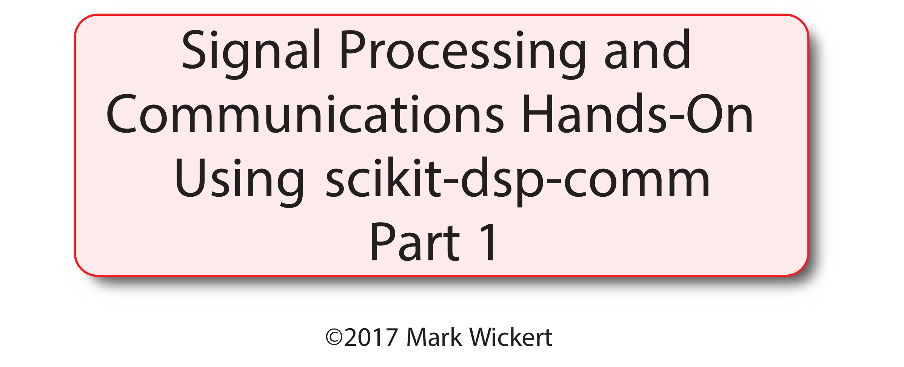

# Signal and System Modeling and Simulation
* Moving ahead from the introductions of Part 0, now its time to introduce/review some of the foundations DSP-Comm 
* DSP and Communications sit on top of the electrical engineering discipline known as *signals and systems*
  * If you have an electrical engineering background you have studied this subject one upoin a time
  * For others this may be totally new, but the concepts has similarities to other disciplines 

## Basic Signals
* What are signals anyway?

  * From a physics perspective they may occur naturally, e.g., a beating heart or wind velocity can both be measured by a *transducer* and converted to an electrical signal which can then be *digitized* by an analog-to-digital converter (DAC);
  * The output of the DAC is a signal in sampled form, or for the purposes of this tutorial *time* sampled form; abstractly a time series
  * Signals frequently are man-made, especially in the realm of DSP for communications

## Time Domain

* A fundamental signal is the sinusoid, that is a function of independent variable $t$ in seconds, having mathematical form

* $$
  \begin{align}
  x_a(t) &=A\cos(2\pi f_0 t+\phi) \\
  x[n] &= A\cos(2\pi f_0/f_s n + \phi)
  \end{align}
  $$

  where the parameter $A$ is known as the *amplitude*, $f_0$ is known as the *frequency* in cycles per second or Hz, and $\phi$ is the *phase shift* of the waveform relative to $t=0$ or $n=0$

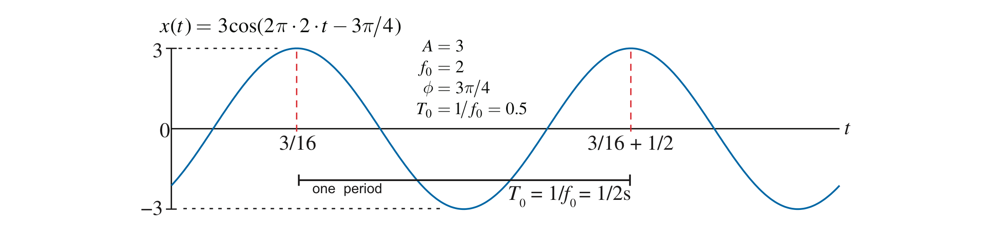

* The first form is a *continuous-time* signal while the second form is *discrete-time*
  * The second form can be obtained from the first by sampling, such as with an ADC (having infinite precision, that is), e.g., $x[n] = x_a(t)|_{t\rightarrow nT}$, where the subscript $a$ emphasizes the fact that the signal is analog in nature and $T = 1/f_s$ is the sampling period
  * The sampling operation has some quirks that show up the frequency $f_0$ in increased (see the figure below):

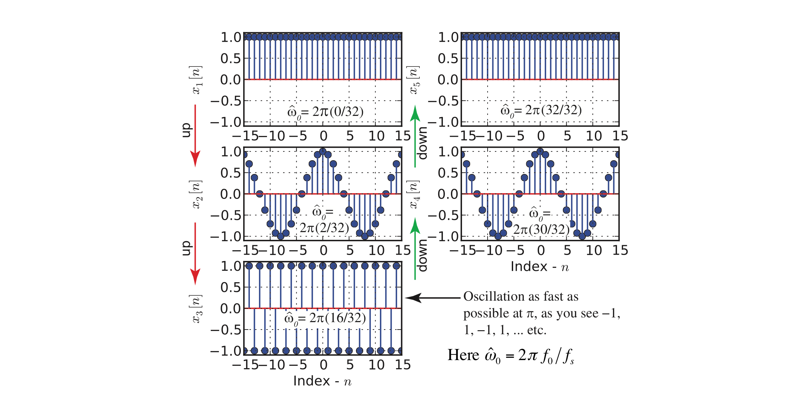

* The above figure shows us that the frequency of a discrete-time sinusoid is not unique, since as $f_0$ is increased above $f_s/2$, know as the folding frequency, the signal oscillation rate comes back down, e.g. attempting to set $f_0 = 3f_s/4$ produces the same signal (to within a phase shift) as setting $f_0 = f_s/4$

> This behavior is known as aliasing, and can be managed so long as the sampling rate, $f_s$ is greater than the highest frequency present in the sampled analog signal $x_a(t)$

* If you extend the notion of aliasing the sampled sinusoid frequency from $f_s/2 <= f_0 <= f_s$ to $0 <= f_0 <= f_s/2$ to higher frequency bands, you end up with the diagram shown below:

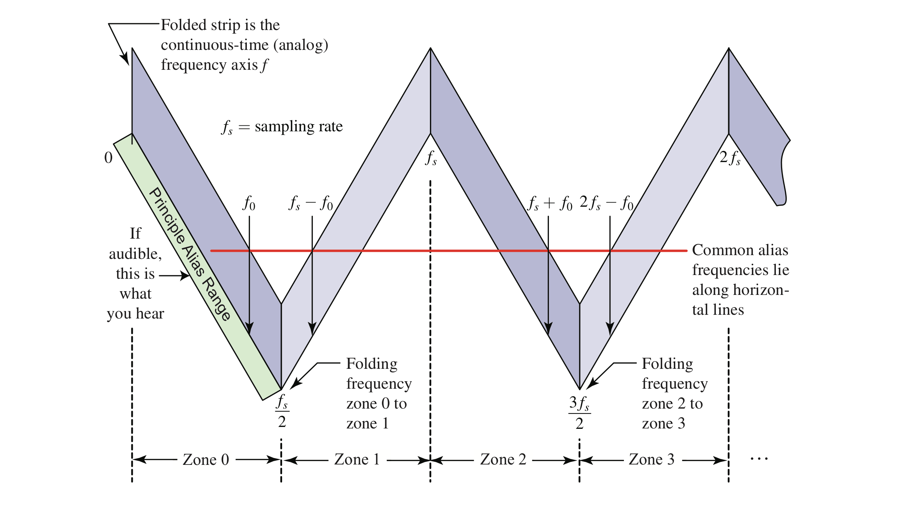

* In **Part2** a cell phone signal generator will be used to study real-time DSP and in particular real-time filtering
  * The phone app signal is generated in discrete-time form using DSP algorithms and then output to a DAC

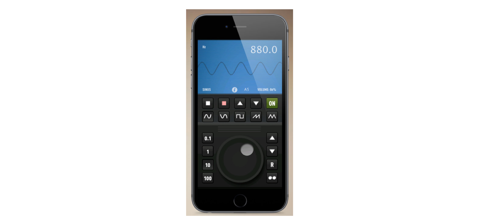

### Pulse Type Signals

* Signals that have finite time duration, or at least have finite energy

$$
E=\int_{-\infty}^\infty |x_a(t)|^2\, dt
$$

​	are also of interest

* These signal types are useful in encoding digital information, such as data transmissions wired and wirelessly

* The rectangular pulse shape was utilized extensively is earlier generations of digital communications, today pulse shapes with a more compact spectrum, such as the *raised cosine* and *square-root cosine* are popular in most all wireless data
  * See spectral view of a signal is discussed in the next subsection
  * `sigsys` contains the functions `rc_imp(Ns,alpha)` for rasied cosine and `sqrt_rc_imp(Ns,alpha)`, where $N_s$ is the number of samples per bit and $\alpha$ is the excess bandwidth attribute 

## Frequency Domain

* Signals *exist* in the *time-domain*, but it is convenient to view their frequency domain representation
* The spectrum is a function of frequency, $f$, and for a sinusoidal signal the notion all of the spectral content lies along the frequency axis at the frequency of the sinusoid (see the figure bvelow)

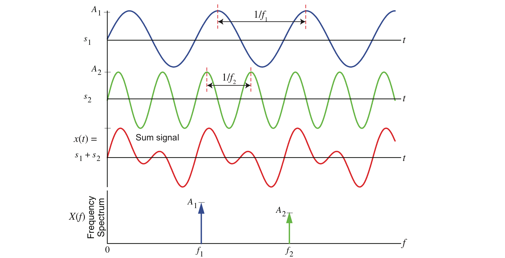

* For pulse type signals the spectrum, $X(f)$, is defined as the *Fourier transform* of the time domain signal

$$
X(f) = \int_{-\infty}^\infty x(t)\, e^{-j2\pi ft}\, dt
$$

* The integral can be approximate numerically, and in particular via the *fast Fourier transform* (FFT)
  * This is investigated briefly in Lab2a using the function `F, X = FT_approx(x,t,Nfft)` found in the notebook `Signals and Systems.ipynb`

# Basic Systems

* A system, $T\{\ \}$, operates on a signal, $x(t)$, to make some change, perhaps to remove noise in a *minimum mean-squared error* (MMSE) sense

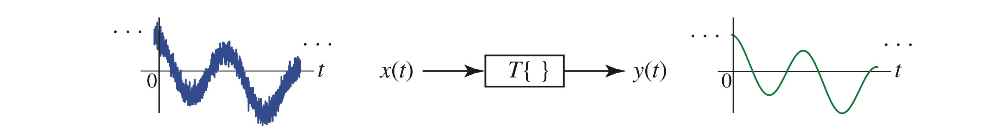

 > A system for which the present output depends only upon the present and past inputs is said to be *causal* or nonanticipatory; **we want this!**

 > In the remainder of this section I focus on discrete-time systems, as discrete-time systems is at the core of the tutorial.

* Linear constant coefficient difference equations (LCCDE), e.g., for *causal* systems, as describer in **Part0** is the ticket:
   $$
   y[n]=-\sum_{k=1}^{N} a_k y[n-k] + \sum_{k=0}^M b_k x[n-k]
   $$

   where $x[n]$ is the input, $y[n]$ is the output, $N\>=0$ is the system order and $M>=0$

   * That (5) actually describes an algorithm for finding $y[n]$; turns out more than one exists, but `y = scipy.signal.lfilter(b,a,x)` performs something very similar on arrays of data
   * The array `b` contains the $b_k$ coefficients and the array `a` contains $[1, a_1, a_2,.\ldots]$

   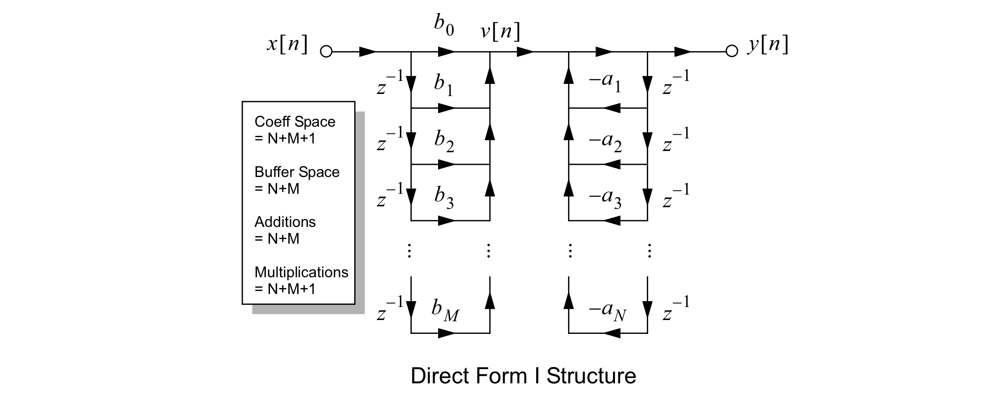

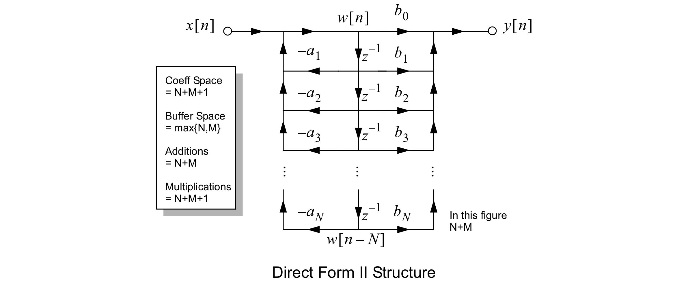

* The analysis of LCCDE systems relies the $z$-*transform* representation of the LCCDE, known as the *system function*

$$
H(z) = \frac{Y(z)}{X(z)} = \frac{\sum_{k=0}^M b_k z^{-k}}{\sum_{k=0}^N a_k z^{-k}} = G \frac{\prod_{k=1}^M (1 - z_k z^{-1})}{\prod_{k=1}^N (1 - p_k z^{-1})}
$$

​	where $G$ is a gain scaling factor

> Simply put the LCCDE description becomes a ratio of polynomials in the complex variable $z$. Filter design tools found in `scipy.signal` and enhanced by the modules `fir_design_helper` and `iir_design_helper` are important pieces in all that is to come/remains in this tutorial
>

* This above is fundamentally otained by taking the $z$-transform of both sides of the LCCDE and then forming the ratio of $Y(z) = \mathcal{Z}\{y[n]\}$ over $X(z) = \mathcal{Z}\{y[x]\}$, where

$$
X(z) = \sum_{n=-\infty}^\infty x[n] z^{-n}
$$

​	where $z$ is a complex variable

* For higher order IIR filters where numerical stability is critical `spicy.signal` and `fir_design_helper` support *cascade of biquads* form, where the numerator and denominator polynomials are each factored into products of second-order polynomials, e.g.,

$$
H(z) = \prod_{k=1}^{N_s} \frac{b_{0k} + b_{1k} z^{-1} + b_{2k} z^2}{1 + a_{1k}z^{-1} + a_{2k}z^{-2}} = \prod_{k=1}^{N_s} H_k(z)
$$

​	where $N_s = \lfloor (N+1)/2\rfloor$ is the largest integer in $(N+1)/2$ and the $H_k(z)$ are the biquad sections

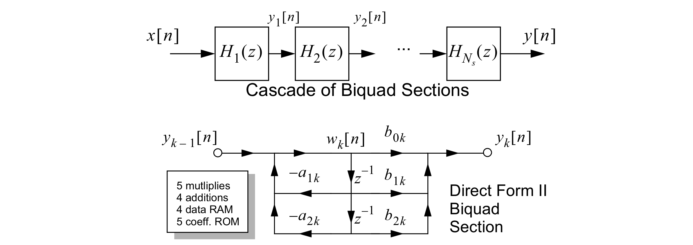

* Filters that fit the LCCDE form fall into two camps: (1) finite impulse response (FIR) for the case $a_k = 0$ for $k > 0$ (through pole-zero cancellation it is possible otherwise too, but unusual) and (2) infinite impulse response (IIR) where in general $a_k \neq 0$ for $k > 0$
  * The notion *impulse response* comes from taking a system at rest and inputting an *impulse*, which in the discrete-time domain is the signal

$$
\delta[n] = \begin{cases}
	1, & n = 0 \\
	0, & \text{otherwise}
\end{cases}
$$

> Without feedback terms in the LCCD, the impulse response of an FIR filter is zero outside some finite interval 

### Example: One-pole Averaging Filter

* A simple, yet popular, IIR filter is the one-pole smoothing filter:

$$
\begin{align}
	y[n] &= \alpha y[n-1] + (1-\alpha) x[n] \\
	H(z) &= \frac{1-\alpha}{1 - \alpha z^{-1}}
\end{align}
$$

​	where $0 < \alpha < 1$ is known as the *forgetting factor*

* The frequency response of this filter, obtained by setting $z=e^{j2\pi f/f_s}$ is related to similar to the $RC$ lowpass studied in basic circuit theory:

* The filter parameter $\alpha$ is related to the $RC$ time constant via

$$
\alpha = e^{-T/(RC)} = e^{-1/(f_s RC)}
$$

* For filter $H(z)$ has a zero at $z=0$ and a pole at $z = \alpha$ 

### FIR Filter Design From Amplitude Response Requirements

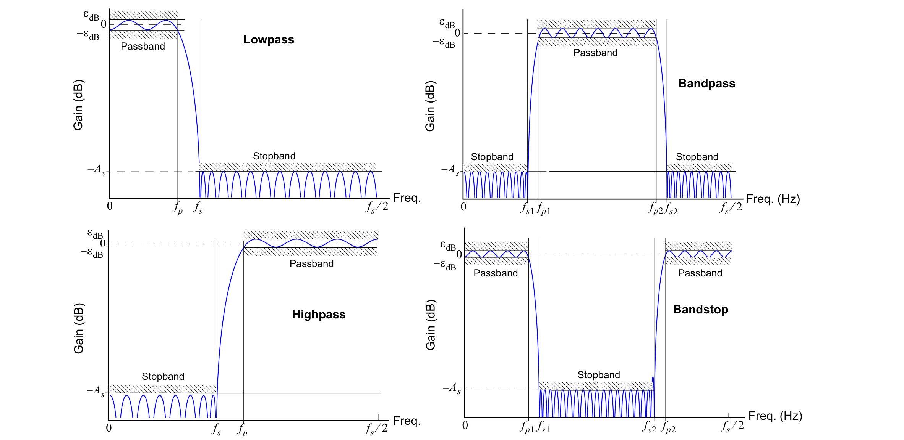

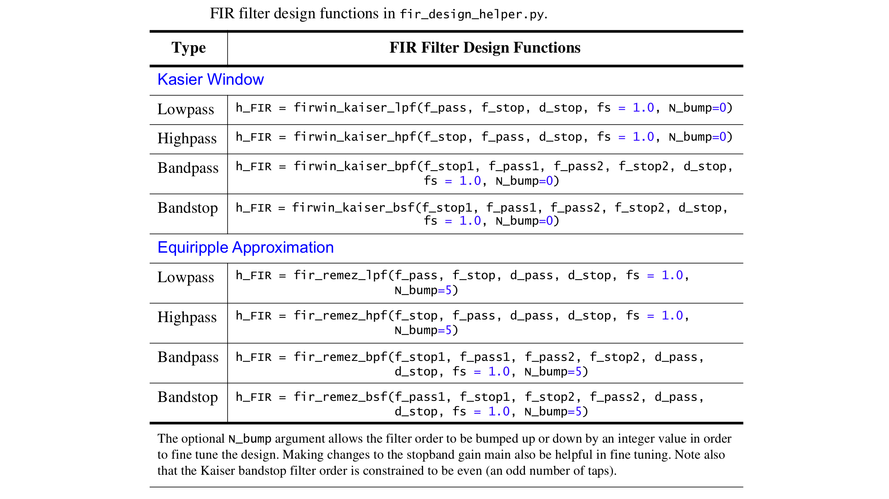

### IIR Filter Design from Amplitude Response Requirements

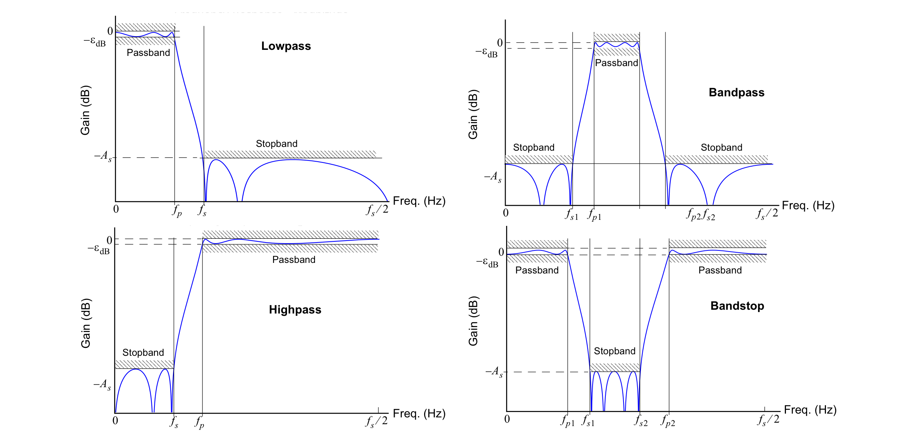

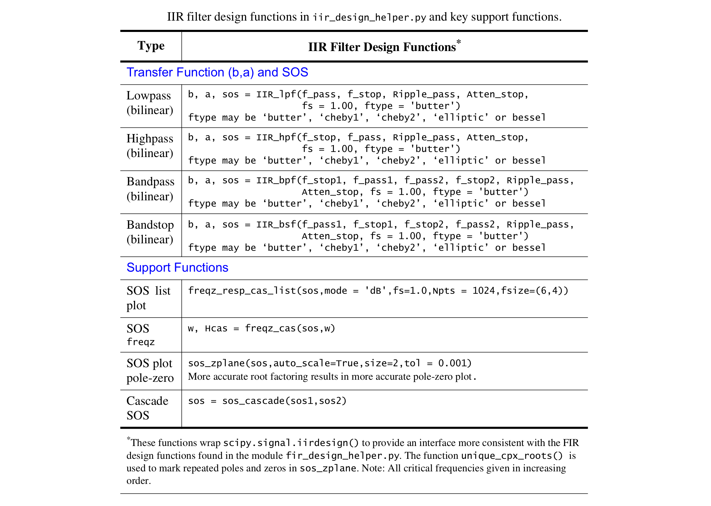

* At this point we are ready to move into Lab2b `FIR Filter Design and C Headers.ipynb` and Lab2c `IIR Filter Design and C Headers.ipynb` which will involve designing FIR and IIR filters, respectively
* Its time to open some Jupyter notebooks