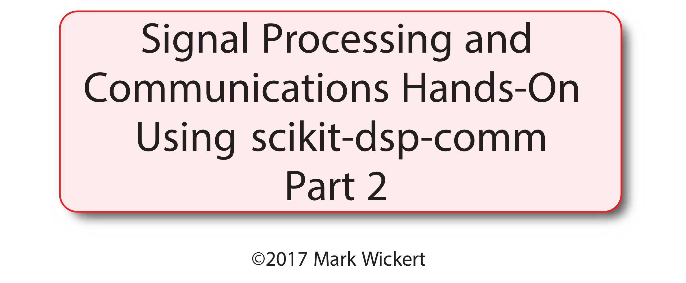
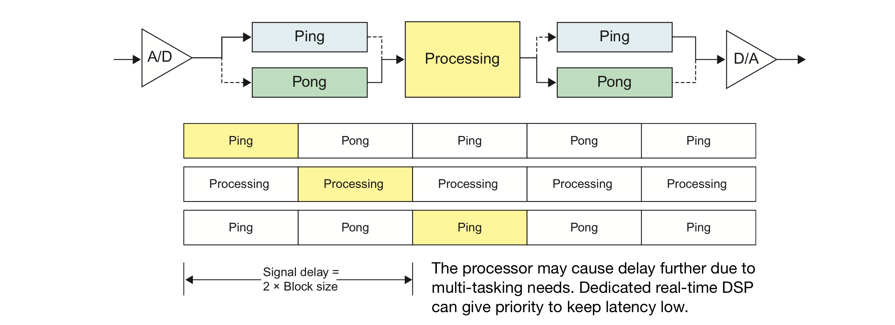

# Real-Time DSP Using PyAudio
* The focus of Part 2 is digging into `pyaudio_helper` beyond what was done in Part 0
* Specifically we want to do real-time input/output of audio signals

## High Level Abstraction

* At a high level the objective is to provide a continuous flow of signal samples from the input ADC to the output DAC

 

* The orange box is where you will be writing code in Python, everything else is hosted in PC hardware, perhaps an external audio dongle, and OS software, including `PyAudio` and the underlying `PortAudio` C++ based library
  * The discrete time processing can in theory be anything, but we have to be aware of the finite processing power available

## PyAudio Interface and the Class `DSP_io_stream`

* Assume that

```python
import sk_dsc_comm.pyaudio_helper as pah
```


* The module `pyaudio_helper` is at present a simple class that  wraps the PyAudio [*wire/callback* example](https://people.csail.mit.edu/hubert/pyaudio/)

```python
def stream(self,Tsec = 2):
	"""
	Stream audio using callback
	"""
	self.N_samples = int(self.fs*Tsec)
    self.data_capture = []
	self.capture_sample_count = 0
	self.DSP_tic = []
	self.DSP_toc = []
	self.start_time = time.time()
	# open stream using callback (3)
	stream = self.p.open(format=pyaudio.paInt16,
                         channels=1,
                         rate=self.fs,
                         input=True,
                         output=True,
                         input_device_index = self.in_idx,
                         output_device_index = self.out_idx,
                         frames_per_buffer = self.frame_length,
                         stream_callback=self.stream_callback)

     # start the stream (4)
     stream.start_stream()

     # wait for stream to finish (5)
     while stream.is_active():
     if self.capture_sample_count >= self.N_samples:
     	stream.stop_stream()
        time.sleep(self.sleep_time)
        # stop stream (6)
        stream.stop_stream()
        stream.close()

        # close PyAudio (7)
        self.p.terminate()
        self.stream_data = True
        print('Audio input/output streaming session complete!')
```

* External to the class is the need for the user to write a the callback function function where the actual real-time DSP work is done
* The catch in writing the callback is that all processing must work with *frames* of signals samples as opposed to *sample-by-sample* processing
* Do you care? Yes, as details like this do matter
* Signal processing algorithms, such as filter, require **state** from one frame to the next to be maintained
* The good news is that the LCCDE filter functions found in `spicy.signal` support frame-based filter through the use of the input of *initial conditions* and pulling out *final conditions*
* A DSP_IO real-time filtering callback is the following:

```python
# Take an IIR filter design
b = fir_d.fir_remez_bpf(2500,3000,4500,5000,.5,60,44100,18)
a = [1] # We need both a and b arrays so for FIR filters we set a = 1
zi = signal.lfiltic(b,a,[0]) # set initial conditions to zero at the start
```

* We have filter coefficients and the filters states, now write the callback

```python
def callback(in_data, frame_count, time_info, status):
    global b, a, zi # need to main these over all calls
    DSP_IO.DSP_callback_tic()
    # convert byte data to ndarray
    in_data_nda = np.fromstring(in_data, dtype=np.int16)
    #***********************************************
    # DSP operations here
    # Here we apply a linear filter to the input
    x = in_data_nda.astype(float32)
    #y = x
    # The filter state/(memory), zi, must be maintained from frame-to-frame 
    y, zi = signal.lfilter(b,a,x,zi=zi) # for FIR or simple IIR
    #y, zi = signal.sosfilt(sos,x,zi=zi) # for IIR use second-order sections    
    #***********************************************
    # Save data for later analysis
    # accumulate a new frame of samples
    DSP_IO.DSP_capture_add_samples(y) 
    #***********************************************
    # Convert from float back to int16
    y = y.astype(int16)
    DSP_IO.DSP_callback_toc()
    return y.tobytes(), pah.pyaudio.paContinue	
```

* Start the processing:

```python
DSP_IO = pah.DSP_io_stream(callback,2,1,Tcapture=0)
DSP_IO.stream(Trun) # run time in seconds
```

* For a long playback time set `Tcapture` just a few seconds, as 0 means fill the capture buffer for `Trun` seconds

### Latency Issues

* Frame-based processing and latency



* The callback scheme is **non-blocking**, which is good for a multi-tasking OS
* With a `frame_length` on the order of 1024 samples the processor has a lot of flexibility in maintaining real-time streaming

### Writing Other Types of Frame-Based Processing in Python

* Beyond filters as described here, state management is up to the programmer and must be adressed on a case-by-case basis
* For example, adaptive filters for example may need to adapt on a sample-by-sample basis given the large frame lengths
* If the DSP algorithm that runs in the call back is too slow Cython or other complied code means can be considered
* A personal goal is to implement streaming of captures from the RTL-SDR, which is the subject of the upcoming **Part3**

